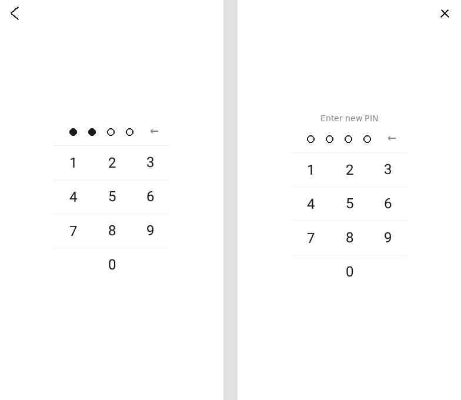

# PinLock

A PIN-code lock screen plugin for [KOReader](https://github.com/koreader/koreader), styled after
the numeric PIN prompt used on stock Kobo firmware: the pad itself is
narrower than the screen and only as tall as it needs to be, centered with room to spare on either
side, over a plain full-screen background.

PinLock can require your PIN:

- when KOReader **starts up**, and/or
- whenever the device **wakes up from sleep/suspend**,

with each of those two triggers switched on independently, and only once you've actually set a PIN.
Nothing is locked by default after installing the plugin — you turn it on yourself.

## Screenshot

The lock screen (left, no text at all) and the "set a new PIN" screen (right), which additionally
shows a close (×) button and a one-line hint since it isn't guarding anything yet:



The keypad digits use a small bundled font (a subset of **Roboto**, Google's own open-source
typeface) rather than KOReader's default UI font, for a cleaner, more "brand-like" numeral shape.

## Installing

1. Download this repository (or just the `pinlock.koplugin` folder from it).
2. Copy the whole `pinlock.koplugin` folder into KOReader's `plugins/` directory.
   - On a jailbroken Kindle, that's typically `koreader/plugins/` inside the KOReader install
     directory on the device (e.g. `/mnt/us/koreader/plugins/` or wherever you installed KOReader).
   - On Kobo, Android, Linux, etc. it's the same idea: `<koreader install dir>/plugins/pinlock.koplugin/`.
3. Restart KOReader.
4. Open the menu → **PinLock** to set a PIN.

You should end up with:

```
koreader/plugins/pinlock.koplugin/
├── _meta.lua
├── main.lua
├── pinlockwidget.lua
└── fonts/
    ├── PinLockDigits-Regular.ttf
    ├── OFL.txt
    └── README.md
```

## Using it

Everything lives in one menu: **☰ → PinLock** (in either the file browser or while reading a book —
it's the same plugin, the same PIN, either way).

- **Set PIN / Change PIN** — walks you through entering a new PIN, then entering it again to confirm.
- **Remove PIN** — clears the stored PIN and automatically turns off both lock triggers below (there's
  no point locking the device with no PIN to unlock it).
- **PIN length: N digits** — 4 to 8 digits. Changing this clears your current PIN, since a PIN's
  length is baked into how it's checked; you'll be asked to set a new one at the new length.
- **Lock on startup** — require the PIN once, when KOReader launches.
- **Lock on wake from sleep** — require the PIN every time the device wakes up from suspend.
- **Lock now** — trigger the lock screen immediately, useful for testing or for binding to a gesture.

Both lock triggers are grayed out until a PIN is set, and both are off by default even after you set
one — turn on whichever one (or both) you actually want.

### Binding "Lock now" to a gesture

PinLock registers a "Lock now (PinLock)" action with KOReader's gesture manager (Dispatcher), so you
can assign it to a tap zone, a swipe, a multiswipe, etc. from **☰ → Settings → Taps and gestures**,
the same way you'd bind any other action.

## Security model — please read this

This is a **casual PIN lock**, similar in spirit to a phone's screen lock — it's meant to stop someone
picking up your Kindle and casually browsing your library or settings, not to withstand a determined,
technically capable attacker with the device in hand.

- The PIN is never stored in plain text: it's hashed with a random per-device salt using SHA-256
  (`ffi/sha2`, already bundled with KOReader) before being saved to
  `koreader/settings/pinlock.lua`.
- That said, anyone with shell/USB access to a jailbroken device (which is exactly the kind of device
  this plugin targets) can delete `koreader/settings/pinlock.lua` to remove the lock entirely, or read
  your books/files directly without ever going through KOReader's UI at all. No app-level lock screen
  can prevent that — it would need full-disk or filesystem-level encryption instead, which is outside
  what a KOReader plugin can do.
- There's no attempt-limiting beyond the single 30-second cooldown described above; it's meant to
  discourage casual guessing, not to be resistant to a sustained brute-force attempt.

If your threat model requires more than "keep a nosy person from poking around my e-reader," this
plugin isn't the right tool.

## Compatibility

Requires a touch-capable device (the keypad is tap-only; there's no physical d-pad/keyboard input
support). This covers essentially every device KOReader runs on today — Kindle, Kobo, Android,
PocketBook, Cervantes, reMarkable, and desktop/emulator builds (via mouse clicks). It does **not**
support the handful of very old button-only Kindles (e.g. Kindle Keyboard/DX).

Tested against KOReader's plugin API as of 2026; it doesn't touch anything version-specific beyond
common widgets (`Button`, `LineWidget`, `IconButton`, etc.) and the `ffi/sha2` hashing module that
have been stable for a long time, so it should keep working across reasonably recent KOReader
releases.

## Contributing / issues

Pull requests and issues welcome. A few known, deliberate limitations if you're looking for ideas:

- No physical-key/d-pad navigation for non-touch devices.
- The 5-attempt / 30-second lockout is fixed, not configurable.
- No "wrong PIN" haptic/visual shake beyond a toast message and clearing the dots (e-ink has no color
  to flash red with).

## License

MIT — see [LICENSE](LICENSE). KOReader itself is licensed under AGPLv3; this plugin is a small,
independent Lua file that runs inside it and doesn't reuse KOReader's own source, so it's offered
under the more permissive MIT license for anyone who wants to reuse or adapt it.
